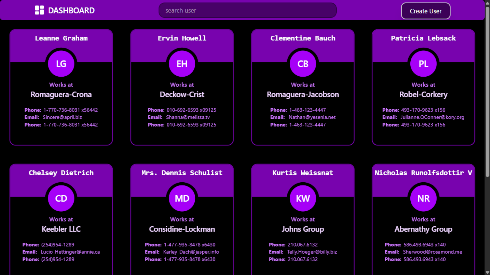
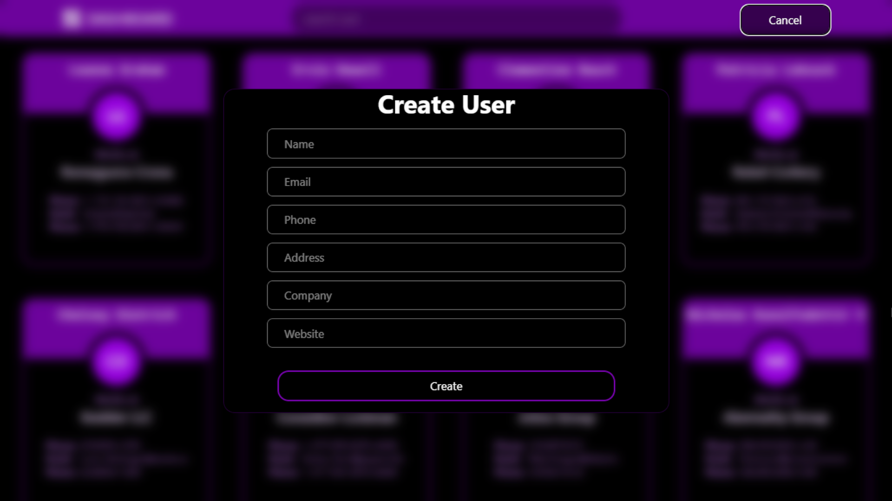
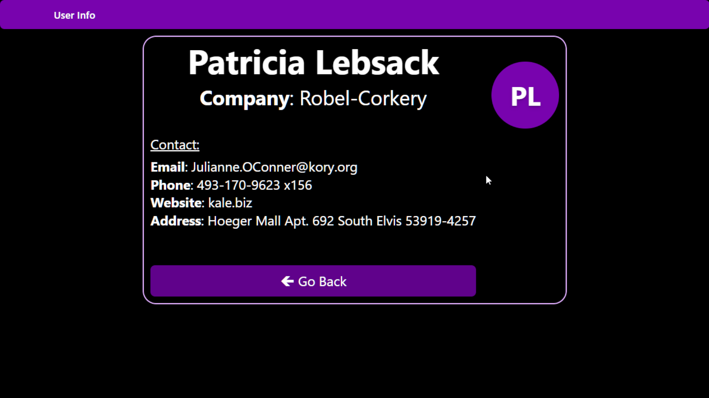
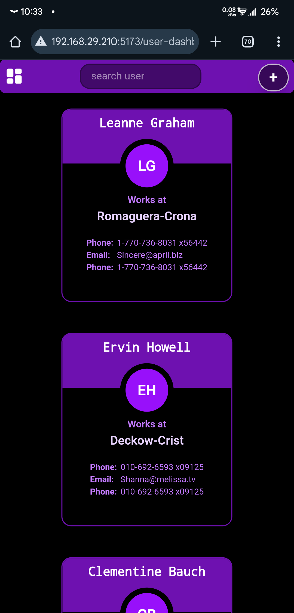
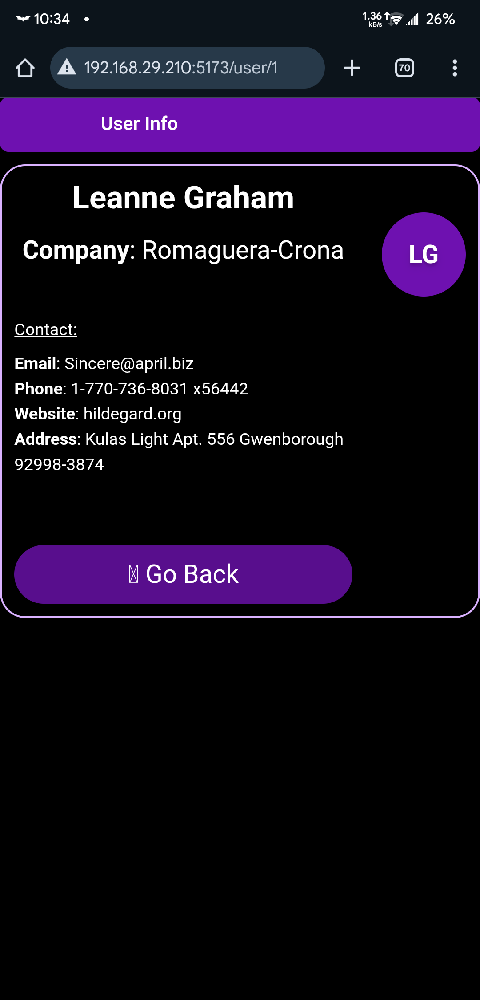
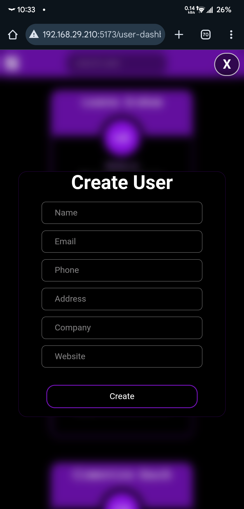

# User Dashboard – React Frontend Assignment

## Overview

A simple **User Dashboard** built with React that displays users fetched from an API, allows searching, viewing , and creating new users on the client side.

## Tech Stack

- React (Functional Components + Hooks)
- React Router DOM
- Redux Toolkit
- Axios
- Tailwind CSS

## Setup Instructions

### 1. Clone the repository

```bash
git clone https://github.com/arshitkk/forty4tech-assignment-frontend.git
cd dashboard
```

### 2. Install dependencies

```bash
npm install
```

### 3. Start the development server

```bash
npm run dev
```

## Screenshots

### Desktop





### Mobile




